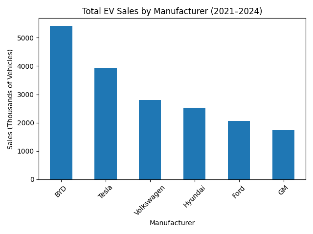
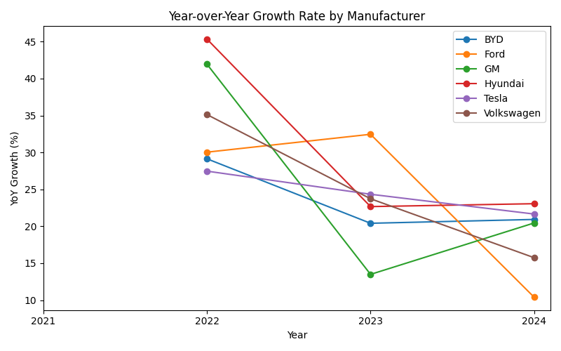

# EV Sales Trends Analysis

## Project Overview
The goal of this Electric Vehicle (EV) Sales Trends analysis project is to evaluate quarterly EV sales performance over recent years to understand market growth, customer adoption patterns, and changes in demand. To maintain a focused and measurable scope, the analysis concentrates on sales volume by manufacturer and does not incorporate external factors such as demographics, affordability, or gasoline prices.

This analysis helps stakeholders assess overall market momentum and identify high-growth EV manufacturers through year-over-year and quarterly trend comparisons. Primary stakeholders include EV manufacturers and their supply chain partners, who can use these insights for production planning, inventory management, and resource allocation. Secondary stakeholders include battery and charging infrastructure providers, government agencies focused on sustainability initiatives, and consumers researching market trends.

Insights from this project support data-driven decisions such as adjusting production levels, reallocating marketing efforts, entering new markets, and prioritizing technological improvements based on competitive performance.

## Dataset
- Timeframe: 2021–2024 (quarterly)
- Manufacturers: Tesla, BYD, Volkswagen, GM, Ford, Hyundai
- Regions: North America, Europe, China, Asia ex-China
- Metric: Sales_Thousands (e.g., 1495.5 = ~1.5 million vehicles)

The dataset is synthetic and designed to reflect realistic market dynamics for portfolio demonstration purposes.

## Key Insights
- BYD leads total EV sales over the 2021–2024 period with approximately 1.5 million vehicles sold, followed by Tesla.  
- Tesla demonstrates the most consistent year-over-year growth, with BYD showing the second most stable growth pattern. Other manufacturers exhibit more volatile and inconsistent growth over the same period.

## Visuals
### Total EV Sales by Manufacturer

### Year-over-Year Growth Rate by Manufacturer

